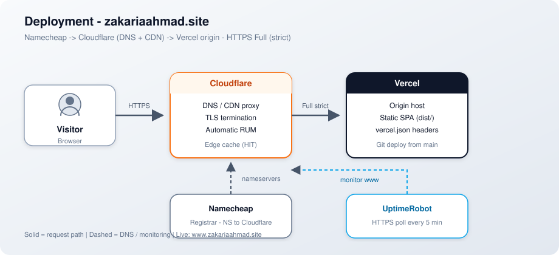
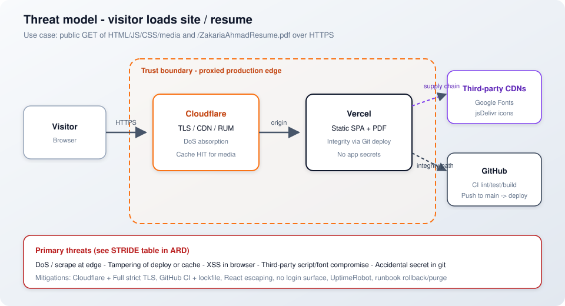

# Architecture Response Document (ARD)

**System:** zakariaahmad.site (`cv-website`)  
**Status:** current production  
**Last updated:** 2026-09-23 (threat model + fitness checks in §7)

Standards: [`engineering-charter.md`](engineering-charter.md). Ops: [`../RUNBOOK.md`](../RUNBOOK.md). Commands: [`../README.md`](../README.md).

**How to view diagrams:** open this file in **VS Code** → **Ctrl+Shift+V**. If an SVG shows “error occurred while loading the image”, run **Markdown: Change Preview Security Settings** → **Allow insecure content** (Strict blocks local SVGs). Cursor’s inline Markdown toggle does not render these images.

---

## 1. Context

### Scope

- Public personal portfolio / CV: hero, about/experience, projects (+ lightbox), skills, contact, resume PDF download.
- Static React + Vite SPA deployed to Vercel; Cloudflare as DNS + reverse-proxy CDN in front of the origin.
- Characterizing tests (Vitest) and GitHub Actions CI (lint, test, build).

### Out of Scope

- Backend APIs, databases, auth, user accounts, CMS.
- Microservices patterns (circuit breaker, service mesh, bulkhead, rate limiting at the app layer).
- AWS-hosted runtime (course COGS estimates may *model* analogous cloud cost; production does not run on AWS today).

---

## 2. Proposed Approach

Single deployable static frontend. Content is data modules under `src/data/`; UI components stay presentational. Edge caching for hashed assets and public media via origin `Cache-Control` (`vercel.json`). Observability: Cloudflare Web Analytics (Automatic RUM) + UptimeRobot HTTPS monitor.

Right-size: no empty DDD layer folders; grow layers only if a real backend appears.

---

## 3. Individual Components — Roles and Responsibilities

| Component | Role |
| --------- | ---- |
| Browser | Renders the SPA; loads HTML/JS/CSS/media |
| Vite build | Produces `dist/` static assets |
| Vercel | Origin host; serves `dist/`; applies `vercel.json` headers |
| Cloudflare | DNS, TLS termination (proxy), CDN cache for eligible assets, Automatic Web Analytics |
| Namecheap | Domain registrar only (nameservers → Cloudflare) |
| UptimeRobot | External availability detect (HTTPS every 5 minutes) |
| GitHub Actions | CI: `npm ci` → lint → test → build on PR and `main` |
| `src/data/*` | Portfolio copy (projects, experience, skills, profile) |
| `public/*` | Static files (photos, resume PDF, robots, sitemap) |

---

## 4. Deployment

- Production URL: `https://www.zakariaahmad.site/` (apex redirects to www).
- SSL: Cloudflare **Full (strict)** toward Vercel.
- Deploy path: merge to `main` → Vercel production deploy (Git integration).
- Cache: `/assets/*` immutable long-cache; `*.(avif|png|webp|svg|webm|pdf)` 30-day cache with SWR (see `vercel.json`).
- Incident / purge / rollback steps: [`../RUNBOOK.md`](../RUNBOOK.md).
- First-time CDN wiring steps: [`../README.md`](../README.md) — Domain / CDN.

---

## 5. Dependencies

| Dependency | Use |
| ---------- | --- |
| Node 20.19+ / 22.12+ | Local/CI tooling (Vite 8) |
| React + Vite | UI framework / bundler |
| Vercel | Hosting |
| Cloudflare | DNS, CDN, RUM |
| Namecheap | Registrar |
| UptimeRobot | Uptime alerts |
| Google Fonts | Typography (loaded from `index.html`) |
| jsDelivr (Devicon / Simple Icons) | Skill icon SVGs at runtime |
| GitHub | Source + Actions CI |

No application database. No secrets required for the static site itself (hosting dashboards hold account credentials outside the repo).

---

## 6. Data Flows / APIs

- **No first-party HTTP API.** The site is static files only.
- Browser → Cloudflare → Vercel: GET HTML, JS, CSS, images, PDF.
- Browser → Google Fonts / jsDelivr: third-party asset fetches (icons, fonts).
- RUM: Cloudflare Automatic injection on proxied pages (no manual beacon in HTML).
- Contact links are `mailto:` / external profile URLs — no form POST backend.

Diagrams: [deployment.svg](deployment.svg), [threat-model-visitor-load.svg](threat-model-visitor-load.svg). Add C4 Context / Containers / sequence SVGs beside this ARD when flows become non-trivial.

---

## 7. Security Concerns

Current production security for this static public portfolio. AuthN/AuthZ protocols (OAuth, JWT, RBAC, MFA), secrets managers, and GenAI/LLM app risks are **Out of Scope** — there is no login, API, or AI agent surface.

Quality-attribute **evaluation scenarios** (stimulus → response → measure) live in [`../QUALITY_ATTRIBUTES.md`](../QUALITY_ATTRIBUTES.md) — treat those as the lightweight utility-tree leaves for this system; do not duplicate them here.

### CIA (current production)

| Principle | How it applies here |
| --------- | ------------------- |
| **Confidentiality** | No private user data store. Public resume/contact are intentional. HTTPS (Cloudflare Full strict → Vercel) protects data in transit. No app secrets expected in git — a committed secret is P0. |
| **Integrity** | Content is first-party `src/data/*` + `public/*`, shipped via Git + CI + Vercel. React escaping reduces XSS on rendered copy. Lockfile pins npm deps. No user-generated content. |
| **Availability** | Detect/recover via [`../RUNBOOK.md`](../RUNBOOK.md) + UptimeRobot; CDN edge for media. DDoS/abuse: rely on Cloudflare edge; do not enable Bot Fight Mode blindly (can block monitors). |

### Threat model — visitor loads site / resume

**Scope:** public visitor opens `https://www.zakariaahmad.site/` and may download `/ZakariaAhmadResume.pdf`.

| STRIDE | Applies? | What can go wrong | Mitigation (current) |
| ------ | -------- | ----------------- | -------------------- |
| **S**poofing | **Low** | Phishing / lookalike domain; no in-app identity to steal | Public site only; registrar + Cloudflare DNS ownership |
| **T**ampering | **Medium** | Bad deploy, stale/poisoned edge cache, compromised dependency | GitHub → Vercel path; CI lint/test/build; lockfile; Cloudflare purge in runbook |
| **R**epudiation | **N/A** | No privileged actions to deny | Read-only public GET |
| **I**nformation disclosure | **Low** | Resume/contact are public by design; accidental secret in repo | No secrets expected; treat commit of secrets as P0 |
| **D**enial of service | **Medium** | Flood / scrape / origin overload | Cloudflare edge; UptimeRobot; runbook rollback |
| **E**levation of privilege | **N/A** | No authz roles or admin surface | Fully public read-only |

### Fitness checks (automated / operational)

Architecture fitness here means gates that already run — not a separate review ritual:

| Check | Gate | Quality attribute |
| ----- | ---- | ----------------- |
| `npm run lint` | CI | Modifiability / consistency |
| `npm test` (incl. CDN header + runbook locks) | CI | Integrity / scalability docs↔config |
| `npm run build` | CI | Deployability |
| UptimeRobot HTTPS every 5 min | Runtime | Availability |
| Cloudflare Web Analytics (LCP) | Runtime RUM | Performance |
| Measured scenarios | [`../QUALITY_ATTRIBUTES.md`](../QUALITY_ATTRIBUTES.md) | Evaluation baseline |

### Posture summary

| Concern | Current posture |
| ------- | --------------- |
| Transport | HTTPS via Cloudflare + Vercel; Full (strict) |
| AuthZ / AuthN | None — fully public read-only site (by design) |
| Secrets in repo | None expected; treat a committed secret as a P0 |
| Supply chain | npm lockfile + CI; third-party CDNs for fonts/icons (availability/privacy tradeoff) |
| Abuse / scrape | Static; optional Cloudflare controls — do not enable Bot Fight Mode blindly |
| XSS | React escaping; content is first-party data modules, not user-generated |

### OWASP Top 10 — applicability

| # | Risk | Applies? | Notes for this site |
| - | ---- | -------- | ------------------- |
| 1 | Broken access control | **N/A** | No authenticated resources or privileged APIs |
| 2 | Cryptographic failures | **Low** | TLS 1.2+ via Cloudflare/Vercel; no password store to hash |
| 3 | Injection | **Low** | No SQL/server templates; React escapes text; no form POST backend |
| 4 | Insecure design | **Addressed** | Public read-only SPA; threat surface kept small on purpose |
| 5 | Security misconfiguration | **Watch** | No default creds; origin is static hosting. Security HTTP headers beyond Cache-Control are a possible follow-up |
| 6 | Vulnerable components | **Watch** | Depend on `package-lock.json` + CI build; periodic `npm audit` / Dependabot is a possible follow-up |
| 7 | Authentication failures | **N/A** | No login |
| 8 | Software and data integrity | **Partial** | GitHub → Vercel deploy path; lockfile; no signed releases yet |
| 9 | Security logging failures | **Minimal** | Hosting/CDN/RUM dashboards; no app security-event log (acceptable for static public site) |
| 10 | SSRF | **N/A** | No server that fetches caller-controlled URLs |

### Explicitly out of scope

- Password/MFA/OIDC/SAML/Kerberos/LDAP authentication
- OAuth 2.0 / JWT / RBAC authorization models
- Centralized secrets managers (Vault, AWS Secrets Manager, etc.)
- Application-layer cryptography beyond TLS
- GenAI/LLM application threat catalogs (no AI features)
- Full multi-stakeholder ATAM workshops (solo portfolio; scenarios live in QUALITY_ATTRIBUTES)
- Organizational compliance programs (NIS2 / CRA) as product obligations

### NIST CSF (lightweight map)

| Function | This site |
| -------- | --------- |
| Identify | ARD + this section; third-party fonts/icons listed under Dependencies |
| Protect | HTTPS, lockfile, React escaping, no secrets in repo |
| Detect | UptimeRobot; Cloudflare/Vercel dashboards |
| Respond | [`../RUNBOOK.md`](../RUNBOOK.md) |
| Recover | Vercel rollback + Cloudflare purge (runbook) |

---

## 8. COGS

**Current production (approximate, free/hobby tiers):**

| Cost center | Typical monthly cost (assumptions) |
| ----------- | ---------------------------------- |
| Namecheap domain | ~$10–15 / year (~$1 / month amortized) |
| Vercel Hobby | $0 at current traffic |
| Cloudflare Free | $0 (DNS + CDN + Automatic Web Analytics) |
| UptimeRobot Free | $0 |
| Google Fonts / jsDelivr | $0 (third-party) |
| Data transfer | Absorbed by Cloudflare/Vercel free allowances at ~thousands of requests/month |

**Course note (Lesson 12):** If modeling this portfolio *as if* on AWS for ARD homework, use [AWS Price Calculator](https://calculator.aws/) with explicit assumptions (e.g. S3 + CloudFront + Route 53 analogues to object storage + CDN + DNS), compare **≥2 regions**, and record the estimate + assumptions here. Production today is **not** on AWS — label any AWS figures as a **course model**, not live spend.
